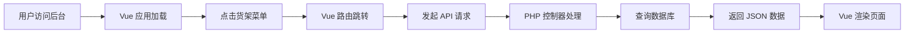

# 货架管理模块 - CRMEB V5.6.3.1 架构说明

## 架构模式

### Vue SPA 架构

- **后台是 Vue 单页应用（SPA）**
- **前端位置**：`public/admin/`
- **所有页面由 Vue 渲染**，不使用 ThinkPHP 模板
- **控制器只提供 API 接口**，返回 JSON 数据

### 前后端分离

```
前端（Vue）              后端（PHP API）
public/admin/    ←→    app/adminapi/controller/
- shelf_management.vue      - v1/shelf/Shelf.php
- 其他 Vue 组件              - 返回 JSON 数据
```

---

## 📂 正确的文件结构

### 后端 API 控制器

```
app/adminapi/controller/v1/shelf/
└── Shelf.php ✅
    ├── index()  - 货架列表 API
    ├── stock()  - 库存管理 API
    └── report() - 销售报表 API
```

### 前端 Vue 文件

```
public/admin/
├── shelf_management.vue ✅
├── index.html          # Vue 入口
└── system_static/      # 静态资源
```

### ❌ 不存在的文件

```
app/adminapi/view/shelf/  ← 此目录已删除
├── index.html   ❌ 不使用
├── stock.html   ❌ 不使用
└── report.html  ❌ 不使用
```

---

## ⚙️ 控制器规范

### 继承关系

```php
namespace app\adminapi\controller\v1\shelf;

use app\adminapi\controller\AuthController;

class Shelf extends AuthController
{
    // 自动继承权限验证
    // 自动获取管理员信息
}
```

### 返回格式

**所有方法必须返回 JSON**：

```php
return json([
    'code' => 200,
    'msg' => 'success',
    'data' => [
        // 业务数据
    ]
]);
```

### ❌ 禁止使用

```php
// 不使用模板渲染
return view('shelf/index');  // ❌
return fetch();              // ❌

// 必须返回 JSON
return json([...]);          // ✅
```

---

## 🗂️ 菜单与路由

### Vue 路由

```javascript
// 前端路由配置
{
  path: '/admin/shelf/index',
  component: () => import('@/pages/shelf/index')
}
```

### API 接口路由

```php
// 后端 API 路由
GET  /adminapi/v1/shelf/index   → Shelf::index()
GET  /adminapi/v1/shelf/stock   → Shelf::stock()
GET  /adminapi/v1/shelf/report  → Shelf::report()
```

### 菜单配置

```
后台管理
└── 货架（一级菜单）
    ├── 货架列表 → Vue 路由：/admin/shelf/index
    ├── 库存管理 → Vue 路由：/admin/shelf/stock
    └── 销售报表 → Vue 路由：/admin/shelf/report
```

---

## 💾 数据库表

### 核心表

- `eb_physical_shelf` - 物理货架表
- `eb_shelf_stock` - 货架商品库存表

### 关联表

- `eb_area` - 区域管理表
- `eb_distributor` - 配送员表
- `eb_store_order` - 订单表（扩展货架字段）
- `eb_user` - 用户表（扩展区域字段）

---

## 🎯 API 接口详情

### 1. 货架列表 API

**接口**：`GET /adminapi/v1/shelf/index`

**参数**：

```json
{
  "keyword": "货架名称",
  "area_id": 1,
  "status": 1,
  "page": 1,
  "limit": 20
}
```

**返回**：

```json
{
  "code": 200,
  "msg": "success",
  "data": {
    "list": [
      {
        "id": 1,
        "name": "A 小区 25 号楼 3 单元货架",
        "code": "SHELF-001",
        "area_name": "A 小区片区",
        "status": 1
      }
    ],
    "total": 10,
    "areas": [...],
    "pagination": {
      "page": 1,
      "limit": 20,
      "total": 10
    }
  }
}
```

### 2. 库存管理 API

**接口**：`GET /adminapi/v1/shelf/stock`

**参数**：

```json
{
  "shelf_id": 1,
  "warning": 0
}
```

**返回**：

```json
{
  "code": 200,
  "msg": "success",
  "data": {
    "list": [
      {
        "id": 1,
        "shelf_name": "A 小区货架",
        "product_name": "矿泉水",
        "stock": 5,
        "warning_stock": 3
      }
    ],
    "shelves": [...],
    "shelf_id": 1,
    "warning": 0
  }
}
```

### 3. 销售报表 API

**接口**：`GET /adminapi/v1/shelf/report`

**参数**：

```json
{
  "start_date": "2026-03-08",
  "end_date": "2026-03-15"
}
```

**返回**：

```json
{
  "code": 200,
  "msg": "success",
  "data": {
    "shelf_stats": [
      {
        "shelf_id": 1,
        "shelf_name": "A 小区货架",
        "order_count": 15,
        "total_sales": 1500.00
      }
    ],
    "product_stats": [...],
    "start_date": "2026-03-08",
    "end_date": "2026-03-15",
    "summary": {
      "total_shelves": 5,
      "total_sales": 8000.00,
      "total_orders": 80
    }
  }
}
```

---

## 🔐 权限控制

### 权限标识

- `admin-shelf-index` - 查看货架列表
- `admin-shelf-stock` - 库存管理
- `admin-shelf-report` - 销售报表

### 自动验证

```php
class Shelf extends AuthController
{
    public function index()
    {
        // 自动验证管理员登录
        // 自动验证权限：admin-shelf-index
    }
}
```

---

## 🚀 部署步骤

### 1. 安装数据库

```bash
mysql -u root -p crmeb < install_shelf_database.sql
mysql -u root -p crmeb < install_shelf_menus.sql
```

### 2. 配置 Vue 路由（如需要）

如果前端 Vue 文件不存在，需要开发：

```
D:\CRMEB-master\template\admin\src\pages\shelf\
├── index.vue      # 货架列表
├── stock.vue      # 库存管理
└── report.vue     # 销售报表
```

### 3. 编译 Vue 项目

```bash
cd D:\CRMEB-master\template\admin
npm run build
```

### 4. 部署到 CRMEB

```bash
# 复制编译后的文件
cp -r dist/* d:\xampp\htdocs\crmeb\public\admin\
```

### 5. 清除缓存

```bash
rm -rf runtime/cache/*
```

### 6. 访问测试

```
http://localhost/admin
# 点击左侧菜单 "货架" → "货架列表"
```

---

## ⚠️ 重要说明

### 1. 关于视图文件

- ❌ **不要创建** `.html` 视图文件
- ✅ **使用** Vue 组件开发前端
- ✅ **控制器只返回** JSON 数据

### 2. 关于路由

- Vue 路由：`/admin/shelf/index`
- API 路由：`/adminapi/v1/shelf/index`
- **两者不同，不要混淆**

### 3. 关于数据交互

```
Vue 组件 → 发起 HTTP 请求 → PHP 控制器
         ← 返回 JSON 数据
```

### 4. 关于权限

- 所有方法自动验证管理员登录
- 需要在后台配置菜单权限
- 权限不足时返回 401 错误

---

## 📊 数据流程图



---

## 🎯 开发规范总结

### ✅ 正确做法

1. 控制器继承 `AuthController`
2. 所有方法返回 `json([...])`
3. 使用 `$this->request->param()` 获取参数
4. 使用 `Db::name('eb_xxx')` 操作数据库
5. 前端使用 Vue 组件开发

### ❌ 错误做法

1. 使用 `view()` 渲染模板
2. 创建 `.html` 视图文件
3. 返回 HTML 而不是 JSON
4. 直接访问 `$_GET`、`$_POST`
5. 使用 ThinkPHP 模板语法

---

## 📞 文件清单

### 后端文件

```
app/adminapi/controller/v1/shelf/
└── Shelf.php ✅ (已修正为 API 接口)
```

### SQL 脚本

```
- install_shelf_database.sql ✅
- install_shelf_menus.sql ✅
```

### 部署工具

```
- install_shelf_module.php ✅
```

### 文档

```
货架管理模块/
├── README.md ✅
├── 快速部署指南.md ✅
├── 货架管理模块部署说明.md ✅
├── 开发上下文.md ✅
└── 架构说明.md ✅ (本文档)
```

---

**架构说明完成时间**：2026-03-15  
**适用版本**：CRMEB V5.6.3.1  
**架构模式**：Vue SPA + PHP API
